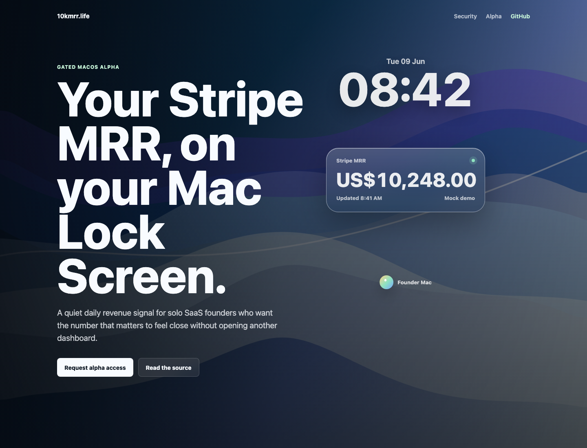
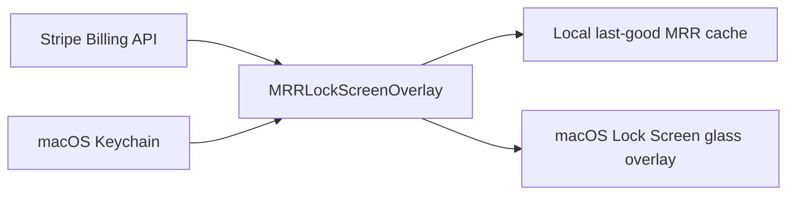

# 10kmrr.life

Your Stripe MRR, on your Mac Lock Screen.

10kmrr.life is a local-first macOS alpha for Mac-first indie hackers and solo SaaS founders who want their Stripe MRR visible every day without opening a full analytics dashboard.

The current app is `MRRLockScreenOverlay`: a macOS background app that reads Stripe subscription data locally, computes Stripe-like MRR, and displays it as a glass panel on the Mac Lock Screen.



## Why I Built This

I wanted my MRR to feel present, not buried inside another dashboard.

Stripe Dashboard is useful, and subscription analytics tools are powerful, but they are places I have to go check. I wanted the opposite: a quiet signal that is already there when I open my Mac. Something that reminds me what I am building toward before I start the day.

I first explored simpler ideas like a screen saver, wallpaper, and widgets. They were close, but they did not show up in the moment I actually cared about: the Mac Lock Screen. So this became a small personal Mac tool for one specific job: make MRR visible as a daily founder operating signal.

The goal is not to build a bigger analytics product. The goal is to make the number that matters feel closer.

## Alpha Status

This is a gated alpha, not a public installer.

- The source is being prepared as an open-source trust surface.
- Actual app installation is approved manually for a small alpha group.
- The app depends on private macOS behavior for Lock Screen placement and private glass rendering.
- Future macOS releases may require fixes.

Do not treat this as a notarized, broadly supported public Mac app yet.

## What It Is Not

10kmrr.life is not a full analytics dashboard and does not try to replace Stripe Dashboard, Baremetrics, ChartMogul, or finance reporting tools.

It is intentionally focused on one job:

> Make your Stripe MRR visible as a daily founder operating and motivation signal.

## Local Security Model

The alpha is local-first:

- Stripe API key: stored in macOS Keychain.
- MRR cache: stored in local user defaults.
- Stripe key and revenue data: not uploaded to a 10kmrr server in the current alpha.

Use a restricted read-only Stripe API key with only the permissions needed to read Billing subscriptions and prices. Do not use a full-access Stripe secret key.

Keychain lookup currently uses:

- current service: `life.10kmrr.MRRLockScreenOverlay`
- legacy fallback service: `life.10kmrr.StripeMRRScreenSaver`
- account: `stripe_api_key`

The legacy service is read for compatibility with the earlier prototype and is migrated to the current service on successful app read.

See [SECURITY.md](./SECURITY.md) for support and disclosure boundaries.
See [PRIVACY.md](./PRIVACY.md) for the public privacy summary.

## Local Architecture



There is no 10kmrr.life server in the current alpha path. The app reads Stripe directly from your Mac, stores the restricted key in Keychain, and keeps only a local last-good cache for offline or failed refresh states.

## Build And Verify

```sh
./script/build_lock_overlay.sh --verify
```

Run focused MRR calculation tests with sanitized Stripe fixtures:

```sh
./script/test_mrr_calculator.sh
```

Before pushing public-alpha repo changes:

```sh
./script/verify_public_repo.sh
```

## Static Alpha Page

Preview the public-alpha landing page locally:

```sh
./script/serve_site.sh
```

Then open `http://127.0.0.1:4173`.

The page uses mock MRR only. Do not use real revenue or unsanitized screenshots in demo assets.

## Preview

Configure your Stripe restricted key first:

```sh
./script/build_lock_overlay.sh --setup
```

You can also use `./script/open_setup.sh`, or configure the key from the terminal with `./script/configure_stripe_key.sh`.

Preview without locking your Mac:

```sh
./script/build_lock_overlay.sh --preview-private-glass
```

The preview follows the screen containing the mouse cursor. It does not unload the installed LaunchAgent.

The setup window also lets you refresh MRR now, confirm when the last-good cache was updated, and choose the local refresh interval and vertical overlay position. These settings are stored locally and apply the next time the overlay starts.

The setup window shows the local app version and build commit so alpha reports can identify the build without sharing private data.

## Install

Alpha installs are gated. If you are approved for alpha testing, run:

```sh
./script/install_lock_overlay_agent.sh
```

If no Stripe key is configured yet, the installer opens the setup window automatically.

The script builds the app, installs it into:

```text
~/Library/Application Support/10kmrr.life/MRRLockScreenOverlay.app
```

and generates a per-user LaunchAgent at:

```text
~/Library/LaunchAgents/life.10kmrr.mrr-lock-overlay.plist
```

The installed LaunchAgent runs:

```text
MRRLockScreenOverlay --private-glass
```

## Diagnose

If the overlay does not appear or the MRR does not refresh, run:

```sh
./script/diagnose.sh
```

The diagnostic checks build status, install status, LaunchAgent state, Keychain presence, and local cache presence without printing the Stripe key or cached MRR value.

## Uninstall

```sh
./script/uninstall_lock_overlay_agent.sh
```

To remove local cache and display settings too:

```sh
./script/uninstall_lock_overlay_agent.sh --local-data
```

To remove the stored Stripe key as well:

```sh
./script/uninstall_lock_overlay_agent.sh --keychain
```

For a full local reset:

```sh
./script/uninstall_lock_overlay_agent.sh --all
```

## MRR Semantics

The overlay computes MRR locally from Stripe subscriptions:

- Includes `active` and `past_due` subscriptions.
- Includes fixed recurring subscription items.
- Normalizes yearly, weekly, and daily intervals to monthly values.
- Excludes trialing, canceled, unpaid, free, and metered-only items.
- Displays separate totals per currency instead of converting currencies.
- Uses the last cached value when Stripe refresh fails.
- Default refresh interval is 5 minutes and can be changed in setup.

## Alpha Feedback

The alpha is testing four things:

- Whether Stripe founders want MRR visible on the Lock Screen after the novelty wears off.
- Whether restricted-key setup feels acceptable.
- Whether the overlay stays useful after 7 days.
- Which Pro upgrades have real pull.

Useful alpha prep docs live under [docs/mvp](./docs/mvp), [docs/alpha](./docs/alpha), and [docs/demo](./docs/demo).

The alpha request template lives at [docs/alpha/alpha-request-template.md](./docs/alpha/alpha-request-template.md).
The Free vs Pro boundary lives at [docs/alpha/free-pro-boundary.md](./docs/alpha/free-pro-boundary.md).
The alpha ops checklist lives at [docs/alpha/alpha-ops-checklist.md](./docs/alpha/alpha-ops-checklist.md).
The install smoke checklist lives at [docs/alpha/install-smoke-checklist.md](./docs/alpha/install-smoke-checklist.md).
The compatibility matrix lives at [docs/alpha/compatibility-matrix.md](./docs/alpha/compatibility-matrix.md).
The safe support playbook lives at [docs/alpha/support-playbook.md](./docs/alpha/support-playbook.md).
The improvement backlog lives at [docs/alpha/improvement-backlog.md](./docs/alpha/improvement-backlog.md).
Contribution rules live at [CONTRIBUTING.md](./CONTRIBUTING.md).
The changelog lives at [CHANGELOG.md](./CHANGELOG.md).

## Open Source Boundary

The intended open-source core is the local app, MRR calculation, Keychain handling, install/verify scripts, and security model.

Paid convenience may later include signed/notarized installers, auto-update, premium visual designs, compatibility maintenance, and priority support.

No public installer is linked until signing, notarization, and support expectations are ready.
