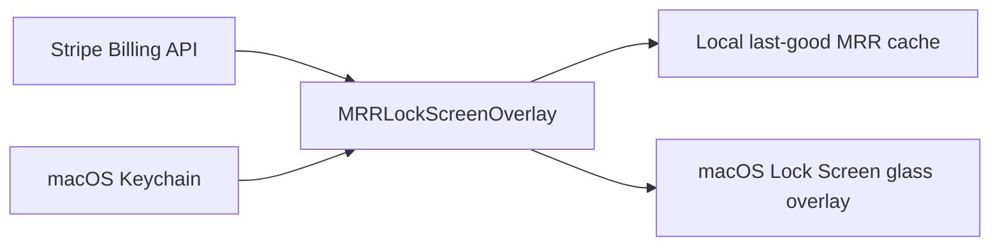

# 10kmrr.life

Your Stripe MRR, on your Mac Lock Screen.

10kmrr.life is a local-first macOS alpha for Mac-first indie hackers and solo SaaS founders who want their Stripe MRR visible every day without opening a full analytics dashboard.

The current app is `MRRLockScreenOverlay`: a macOS background app that reads Stripe subscription data locally, computes Stripe-like MRR, and displays it as a glass panel on the Mac Lock Screen.


## Why I Built This

I wanted my MRR to feel present, not buried inside another dashboard.

Stripe Dashboard is useful, and subscription analytics tools are powerful, but they are places I have to go check. I wanted the opposite: a quiet signal that is already there when I open my Mac. Something that reminds me what I am building toward before I start the day.

I first explored simpler ideas like a screen saver, wallpaper, and widgets. They were close, but they did not show up in the moment I actually cared about: the Mac Lock Screen. So this became a small personal Mac tool for one specific job: make MRR visible as a daily founder operating signal.

The goal is not to build a bigger analytics product. The goal is to make the number that matters feel closer.

## Alpha Status

This is a gated alpha, not a public installer.

- The source is being prepared as an open-source trust surface.
- Actual app installation is approved manually for a small alpha group.
- The app depends on private macOS behavior for Lock Screen placement and private glass rendering.
- The current source build creates a universal macOS binary (`arm64` and `x86_64`).
- Apple Silicon is the locally verified path; Intel Lock Screen behavior still needs alpha compatibility evidence.
- Future macOS releases may require fixes.

Do not treat this as a notarized, broadly supported public Mac app yet.

## What It Is Not

10kmrr.life is not a full analytics dashboard and does not try to replace Stripe Dashboard, Baremetrics, ChartMogul, or finance reporting tools.

It is intentionally focused on one job:

> Make your Stripe MRR visible as a daily founder operating and motivation signal.

## Local Security Model

The alpha is local-first:

- Stripe API key: stored in macOS Keychain.
- MRR cache: stored in local user defaults.
- Stripe key and revenue data: not uploaded to a 10kmrr server in the current alpha.

Use a restricted read-only Stripe API key with only the permissions needed to read Billing subscriptions and prices. Do not use a full-access Stripe secret key.

Keychain lookup currently uses:

- current service: `life.10kmrr.MRRLockScreenOverlay`
- legacy fallback service: `life.10kmrr.StripeMRRScreenSaver`
- account: `stripe_api_key`

The legacy service is read for compatibility with the earlier prototype and is migrated to the current service on successful app read.

See [SECURITY.md](./SECURITY.md) for support and disclosure boundaries.
See [PRIVACY.md](./PRIVACY.md) for the public privacy summary.

## Local Architecture



There is no 10kmrr.life server in the current alpha path. The app reads Stripe directly from your Mac, stores the restricted key in Keychain, and keeps only a local last-good cache for offline or failed refresh states.

## Build And Verify

Current compatibility boundary:

- macOS 14 or later.
- Universal source build for `arm64` and `x86_64`.
- Apple Silicon path is locally verified.
- Intel Mac Lock Screen/private API behavior still needs alpha compatibility evidence before widening distribution.

```sh
./script/build_lock_overlay.sh --verify
```

Run focused MRR calculation tests with sanitized Stripe fixtures:

```sh
./script/test_mrr_calculator.sh
```

Run local MRR cache persistence tests:

```sh
./script/test_mrr_cache.sh
```

Run local display/settings persistence tests:

```sh
./script/test_overlay_settings.sh
```

Run local Stripe key validation checks without touching Keychain:

```sh
./script/configure_stripe_key.sh --self-test
```

Run diagnostic and uninstall safety self-tests without changing your local install:

```sh
./script/diagnose.sh --self-test
./script/uninstall_lock_overlay_agent.sh --self-test
```

Preview the local private-beta smoke sequence without changing local state:

```sh
./script/run_local_smoke.sh
```

Before pushing public-alpha repo changes:

```sh
./script/check.sh
```

The public readiness gate checks shell syntax, focused MRR tests, MRR cache tests, Stripe request tests, overlay settings tests, diagnostic redaction, installer and uninstall self-tests, public-alpha wording, demo asset presence, ignored local artifacts, secret patterns, the universal macOS build, and signing/notarization preflight.

For a lightweight status summary that does not run the full build gate:

```sh
./script/alpha_status.sh
```

This summarizes the current git state, private alpha tracker presence, signing readiness, latest GitHub Actions status when available, and the next safe command to run. It does not print Stripe keys or cached MRR values.

For private beta package readiness after alpha evidence is collected:

```sh
./script/private_beta_readiness.sh
```

This checks install evidence, Lock Screen compatibility, local install/repair/uninstall smoke evidence, repeated private API failures, install failure rate, and Developer ID readiness without printing secrets.

For the public repo sub-gate without signing preflight:

```sh
./script/verify_public_repo.sh
```

Preview GitHub issue label setup before applying it:

```sh
./script/sync_github_labels.sh --dry-run
```

If an installed alpha build gets into a bad LaunchAgent or app-bundle state, repair it without removing the Stripe key, local cache, or display settings:

```sh
./script/repair_lock_overlay_agent.sh
```

Preview the repair steps first:

```sh
./script/repair_lock_overlay_agent.sh --dry-run
```

## Static Alpha Page

Preview the public-alpha landing page locally:

```sh
./script/serve_site.sh
```

Then open `http://127.0.0.1:4173`.

The page uses mock MRR only. Do not use real revenue or unsanitized screenshots in demo assets.

Sanitized mock-only demo assets live under [docs/demo/assets](./docs/demo/assets), including a short MP4 demo loop for public-alpha previews.

## Preview

Configure your Stripe restricted key first:

```sh
./script/build_lock_overlay.sh --setup
```

You can also use `./script/open_setup.sh`, or configure the key from the terminal with `./script/configure_stripe_key.sh`.

Preview without locking your Mac:

```sh
./script/build_lock_overlay.sh --preview-private-glass
```

Preview with mock MRR before configuring a Stripe key:

```sh
./script/build_lock_overlay.sh --preview-mock
```

Preview with private API debug labels:

```sh
./script/build_lock_overlay.sh --preview-debug
```

The preview uses the selected display mode from setup. It does not unload the installed LaunchAgent.

The setup window is organized as a first-run flow: preview mock MRR, save a restricted Stripe key in Keychain, refresh MRR, then use advanced settings only if you want to tune placement, size, display mode, visual style, refresh interval, or an optional MRR goal.

Setup also includes an Install & support card. When the source checkout is detected, it can run `./script/diagnose.sh`, generate and open a sanitized support report, copy install/support commands, and open the local logs folder.

Visual styles include hero panel, full panel, compact panel, number-only, goal panel, and focus panel. Hero is the default first-run style. Goal settings are local-only and are used only to render progress on the Lock Screen.

The setup window shows the local app version and build commit so alpha reports can identify the build without sharing private data.

When the overlay app is running, the 10kmrr.life menu bar item can open setup, refresh MRR now, launch a preview overlay, copy diagnose/uninstall commands for the source checkout, open the local logs folder, and restart the overlay process.

## Install

Alpha installs are gated. If you are approved for alpha testing, use the guided first-run flow:

```sh
./script/start_alpha.sh
```

The guided flow builds the app, opens setup, launches a mock preview, waits for you to save a restricted key in the macOS setup window, then installs the LaunchAgent and runs diagnose.

To preview the steps without changing local state:

```sh
./script/start_alpha.sh --dry-run
```

To install directly after setup is ready:

```sh
./script/install_lock_overlay_agent.sh
```

If no Stripe key is configured yet, the installer opens the setup window automatically.

The script builds the app, installs it into:

```text
~/Library/Application Support/10kmrr.life/MRRLockScreenOverlay.app
```

and generates a per-user LaunchAgent at:

```text
~/Library/LaunchAgents/life.10kmrr.mrr-lock-overlay.plist
```

The installed LaunchAgent runs:

```text
MRRLockScreenOverlay --private-glass
```

## Diagnose

If the overlay does not appear or the MRR does not refresh, run:

```sh
./script/diagnose.sh
```

The diagnostic checks build status, install status, LaunchAgent state, Keychain presence, and local cache presence without printing the Stripe key or cached MRR value.

If diagnose reports LaunchAgent executable, private glass, or log-path drift, run:

```sh
./script/repair_lock_overlay_agent.sh
```

The app logs structured local events such as refresh start/success/failure, overlay show/hide, and private API fallback. Logs do not include Stripe keys, exact MRR values, raw Stripe responses, or customer/payment data by default.

For alpha support, generate a sanitized local report:

```sh
./script/support_report.sh
```

The report includes sanitized diagnostics, log metadata, and suggested next steps such as setup, repair, or full readiness checks. It redacts local paths, Stripe-key-like strings, Stripe object IDs, email-like contact data, webhook secrets, and obvious money amounts. It does not include raw logs unless requested.

Only use `./script/support_report.sh --include-logs` after confirming the local logs do not contain sensitive output.

The public verification gate also runs `./script/support_report.sh --self-test` to prevent redaction regressions.

## Uninstall

```sh
./script/uninstall_lock_overlay_agent.sh
```

To remove local cache and display settings too:

```sh
./script/uninstall_lock_overlay_agent.sh --local-data
```

To remove the stored Stripe key as well:

```sh
./script/uninstall_lock_overlay_agent.sh --keychain
```

For a full local reset:

```sh
./script/uninstall_lock_overlay_agent.sh --all
```

## MRR Semantics

The overlay computes MRR locally from Stripe subscriptions:

- Includes `active` and `past_due` subscriptions.
- Includes fixed recurring subscription items.
- Normalizes yearly, weekly, and daily intervals to monthly values.
- Excludes trialing, canceled, unpaid, free, and metered-only items.
- Displays separate totals per currency instead of converting currencies.
- Uses the last cached value when Stripe refresh fails.
- Default refresh interval is 5 minutes and can be changed in setup.

## Alpha Feedback

The alpha is testing four things:

- Whether Stripe founders want MRR visible on the Lock Screen after the novelty wears off.
- Whether restricted-key setup feels acceptable.
- Whether the overlay stays useful after 7 days.
- Which Pro upgrades have real pull.

Useful alpha prep docs live under [docs/mvp](./docs/mvp), [docs/alpha](./docs/alpha), and [docs/demo](./docs/demo).

The alpha request template lives at [docs/alpha/alpha-request-template.md](./docs/alpha/alpha-request-template.md).
The alpha invite template lives at [docs/alpha/alpha-invite-template.md](./docs/alpha/alpha-invite-template.md).
The Free vs Pro boundary lives at [docs/alpha/free-pro-boundary.md](./docs/alpha/free-pro-boundary.md).
The alpha ops checklist lives at [docs/alpha/alpha-ops-checklist.md](./docs/alpha/alpha-ops-checklist.md).
The private alpha workflow lives at [docs/alpha/private-alpha-workflow.md](./docs/alpha/private-alpha-workflow.md).
Create a private ignored tracker workspace with `./script/prepare_alpha_tracker.sh` before inviting testers.
Refresh only the local tracker instructions with `./script/prepare_alpha_tracker.sh --readme-only`; use `--force` only when you intentionally want to replace empty generated CSV templates.
Append safe tracker rows with `./script/record_alpha_user.sh`, `./script/record_alpha_install.sh`, `./script/record_alpha_compatibility.sh`, `./script/record_alpha_local_smoke.sh`, `./script/record_alpha_pro_followup.sh`, and `./script/record_alpha_weekly_review.sh`; they reject contact-like data, Stripe-key-like strings, and obvious money amounts where relevant.
Run `./script/run_local_smoke.sh --apply --full-reset --record` only on a clean private-beta smoke machine when you are ready to record local install/repair/uninstall evidence. The default run is a dry run and does not change local state.
The install smoke checklist lives at [docs/alpha/install-smoke-checklist.md](./docs/alpha/install-smoke-checklist.md).
The compatibility matrix lives at [docs/alpha/compatibility-matrix.md](./docs/alpha/compatibility-matrix.md).
The safe support playbook lives at [docs/alpha/support-playbook.md](./docs/alpha/support-playbook.md).
The testimonial approval template lives at [docs/alpha/testimonial-approval-template.md](./docs/alpha/testimonial-approval-template.md).
The improvement backlog lives at [docs/alpha/improvement-backlog.md](./docs/alpha/improvement-backlog.md).
Contribution rules live at [CONTRIBUTING.md](./CONTRIBUTING.md).
The changelog lives at [CHANGELOG.md](./CHANGELOG.md).
Private beta packaging criteria live at [docs/release/private-beta-packaging-checklist.md](./docs/release/private-beta-packaging-checklist.md).
Check private beta evidence readiness with `./script/private_beta_readiness.sh` before creating any private package dry run.

## Open Source Boundary

The intended open-source core is the local app, MRR calculation, Keychain handling, install/verify scripts, and security model.

Paid convenience may later include signed/notarized installers, auto-update, premium visual designs, compatibility maintenance, and priority support.

No public installer is linked until signing, notarization, and support expectations are ready.

For private package dry runs only, `./script/package_private_beta.sh --adhoc` creates an explicitly unnotarized zip under `build/private-beta`. It refuses to run until `./script/private_beta_readiness.sh --require-ready` passes. Do not publish it as a public installer.

Run `./script/private_beta_readiness.sh` to see the missing alpha evidence or Developer ID signing prerequisites.

To check whether the machine is ready for Developer ID signing and notarization setup, run `./script/signing_preflight.sh`. It does not print notary credentials.

For strict notarization readiness, store credentials privately with `xcrun notarytool store-credentials <profile-name>`, set `TENKMRR_NOTARY_PROFILE` in your shell, then run `./script/signing_preflight.sh --require-ready`. Do not commit the notary profile name if it identifies a private Apple account or team.
